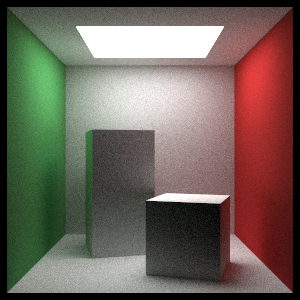

# Rust-Tracer

A Rust implementation of Peter Shirley's books [Ray Tracing in One Weekend](https://smile.amazon.com/Ray-Tracing-Weekend-Minibooks-Book-ebook/dp/B01B5AODD8) and [Ray Tracing: The Next Week](https://smile.amazon.com/Ray-Tracing-Next-Week-Minibooks-ebook/dp/B01CO7PQ8C).

While this began as a simple port/reimplementation of the above books, it has since grown to include features not demonstrated in the books.

**Notable examples include:**
* Nonhomogeneous Participating Media (distance sampling performed via Woodcock tracking)
* Support for rendering polygonal primitives and polygon meshes
* Support for multi-threaded rendering

## Latest Render

